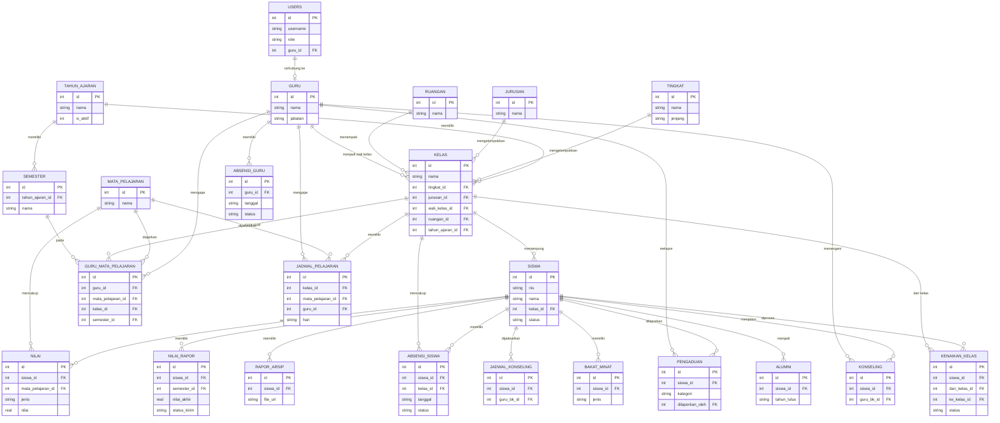

# Entity Relationship Diagram (ERD)
## Sistem Informasi Madrasah Tingkat MA dan MTs

Diagram ini adalah representasi visual dari `schema.sql`. Gunakan sebagai acuan relasi antar tabel saat implementasi backend/frontend agar konsisten antar sesi pengerjaan (termasuk saat dibantu CLI AI coding).

## Catatan Relasi Penting
- `USERS.guru_id` bersifat opsional — hanya terisi untuk role yang terhubung ke data guru (Wakil Kurikulum, Kepala Madrasah bila dijabat guru, Guru Mapel/Wali Kelas, Guru BK).
- `SISWA` tidak memiliki relasi ke `USERS` — sesuai ruang lingkup, siswa bukan pengguna sistem.
- `KELAS.wali_kelas_id` merujuk ke `GURU`, bukan tabel terpisah — wali kelas adalah guru dengan penugasan tambahan.
- `PENGADUAN` menjadi jembatan data antara Guru Mapel/Wali Kelas (pelapor) dan Guru BK (pembaca laporan).
